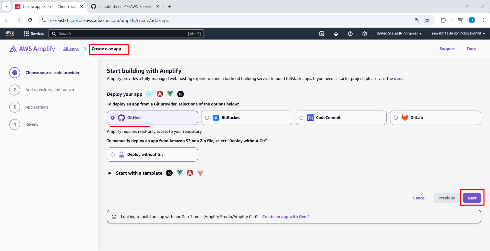
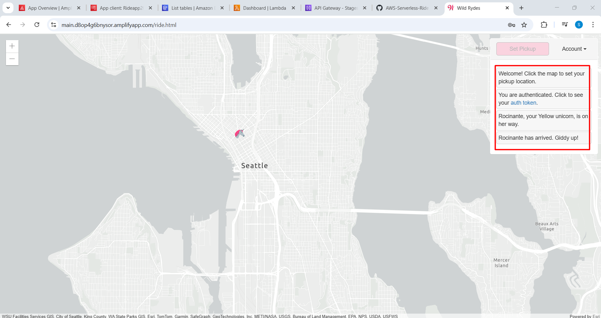
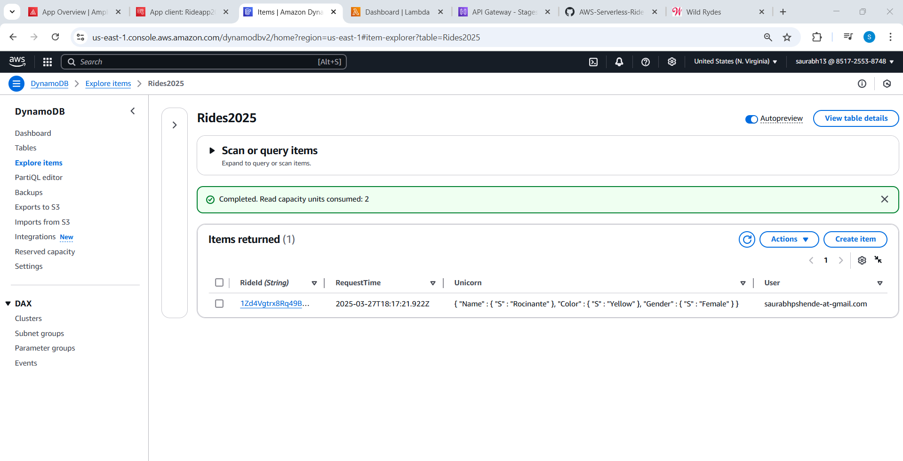

# AWS-Serverless-Ride-App-using-Amplify-Cognito-API-Gateway-Lambda-and-DynamoDB


This project demonstrates how to build and deploy a serverless ride-hailing web application using various AWS services, including:

- **Amplify** for hosting the frontend
- **Cognito** for user authentication
- **API Gateway** for routing API requests
- **Lambda** for serverless compute
- **DynamoDB** for storing ride information

---

## 🗂️ Architecture Overview

The app allows users to register/login, select their pickup location, and request a ride. A random unicorn (rider) is assigned, and the ride details are stored in a DynamoDB table. The entire backend is built using AWS serverless components.

---

## 🚀 Project Setup Steps

### ✅ Step 1: Create DynamoDB Table

- Go to **DynamoDB** in AWS Console.
- Create a new table with:
  - **Table name**: `Rides`
  - **Partition key**: `RideId`


---

### 🧠 Step 2: Create Lambda Function

- Go to **Lambda** and create a function:
  - Runtime: `Node.js 20.x`
  - Permissions: Attach a role with **DynamoDB write access**


#### 🔧 Lambda Code (index.mjs or similar):

```javascript
import { randomBytes } from 'crypto';
import { DynamoDBClient } from '@aws-sdk/client-dynamodb';
import { DynamoDBDocumentClient, PutCommand } from '@aws-sdk/lib-dynamodb';

const client = new DynamoDBClient({});
const ddb = DynamoDBDocumentClient.from(client);

const fleet = [
    { Name: 'Angel', Color: 'White', Gender: 'Female' },
    { Name: 'Gil', Color: 'White', Gender: 'Male' },
    { Name: 'Rocinante', Color: 'Yellow', Gender: 'Female' },
];

export const handler = async (event, context) => {
    if (!event.requestContext.authorizer) {
        return errorResponse('Authorization not configured', context.awsRequestId);
    }

    const rideId = toUrlString(randomBytes(16));
    const username = event.requestContext.authorizer.claims['cognito:username'];
    const requestBody = JSON.parse(event.body);
    const pickupLocation = requestBody.PickupLocation;

    const unicorn = findUnicorn(pickupLocation);

    try {
        await recordRide(rideId, username, unicorn);
        return {
            statusCode: 201,
            body: JSON.stringify({
                RideId: rideId,
                Unicorn: unicorn,
                Eta: '30 seconds',
                Rider: username,
            }),
            headers: {
                'Access-Control-Allow-Origin': '*',
            },
        };
    } catch (err) {
        return errorResponse(err.message, context.awsRequestId);
    }
};

function findUnicorn(pickupLocation) {
    return fleet[Math.floor(Math.random() * fleet.length)];
}

async function recordRide(rideId, username, unicorn) {
    const params = {
        TableName: 'Rides',
        Item: {
            RideId: rideId,
            User: username,
            Unicorn: unicorn,
            RequestTime: new Date().toISOString(),
        },
    };
    await ddb.send(new PutCommand(params));
}

function toUrlString(buffer) {
    return buffer.toString('base64').replace(/\+/g, '-').replace(/\//g, '_').replace(/=/g, '');
}

function errorResponse(errorMessage, awsRequestId) {
    return {
        statusCode: 500,
        body: JSON.stringify({ Error: errorMessage, Reference: awsRequestId }),
        headers: { 'Access-Control-Allow-Origin': '*' },
    };
}
```

> **Note:** Replace `TableName` with your actual DynamoDB table name if different.

- Deploy the function.


#### 🧪 Test the Lambda Function

Create a test event:

```json
{
    "path": "/ride",
    "httpMethod": "POST",
    "headers": {
        "Accept": "*/*",
        "Authorization": "eyJraWQiOiJLTzRVMWZs",
        "content-type": "application/json; charset=UTF-8"
    },
    "queryStringParameters": null,
    "pathParameters": null,
    "requestContext": {
        "authorizer": {
            "claims": {
                "cognito:username": "the_username"
            }
        }
    },
    "body": "{\"PickupLocation\":{\"Latitude\":47.6174755835663,\"Longitude\":-122.28837066650185}}"
}
```

Click **Test**.


---

### 🔐 Step 3: Set Up Cognito User Pool

- Create a new **User Pool** for authentication.
- Set up app client and enable email-based signup.


---

### 🌐 Step 4: Create API Gateway

- Create a **REST API**.


- Create a resource named `/ride` and enable **CORS**.


- Add a **POST** method that integrates with the Lambda function.


- Create a **Cognito Authorizer**:
  - Set type to Cognito.
  - Choose your user pool.
  - Set token source as `Authorization`.


- Update **Method Request** to use authorization.


- Deploy the API to a new or existing stage.


> **Important:** Update your frontend’s `config.js` with:
```js
const config = {
    UserPoolId: "us-east-1_XXXXXX",
    UserPoolClientId: "XXXXXXXXXXXXXXXXXXXX",
    Region: "us-east-1",
    ApiEndpoint: "https://xyz.execute-api.amazonaws.com/prod"
};
```


---

### ⚙️ Step 5: Deploy Frontend using AWS Amplify

- Go to **AWS Amplify**.
- Connect your GitHub repository.




- Save and deploy the application.


---

### ✅ Step 6: Verify the App

- Open the Amplify app using the provided domain.
- Click **Giddy Up** to register.


- Register with your email and password.


- Confirm registration using the email verification code.


- Log in and select your pickup location.


- A unicorn will be assigned to your location.



- Check **DynamoDB** to see the ride record.



- Visit **Cognito User Pool** to view/manage users.


---

## 🧱 Tech Stack

- AWS Amplify
- AWS Cognito
- AWS Lambda (Node.js 20)
- API Gateway
- DynamoDB
- GitHub for source control

---

## 📷 Demo Screenshots

(Include all step screenshots already linked in the `steps/` folder)

---

## 🙌 Acknowledgements

Thanks to the AWS Serverless Application Model and tutorials from AWS Workshops that inspired parts of this project.

---

## 📬 Contact

For suggestions, queries, or collaborations, feel free to reach out via [saurabhshende13@gmail.com](mailto:saurabhshende13@gmail.com)
```
